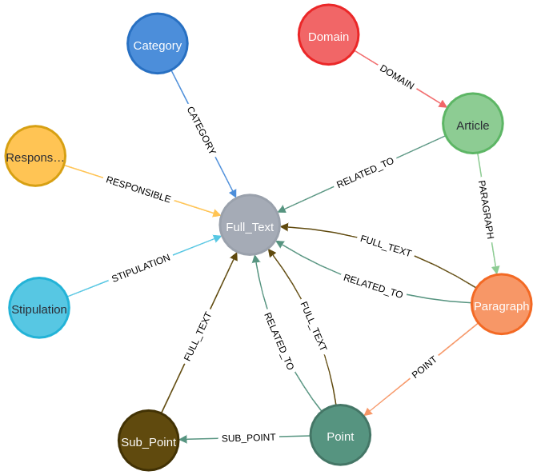
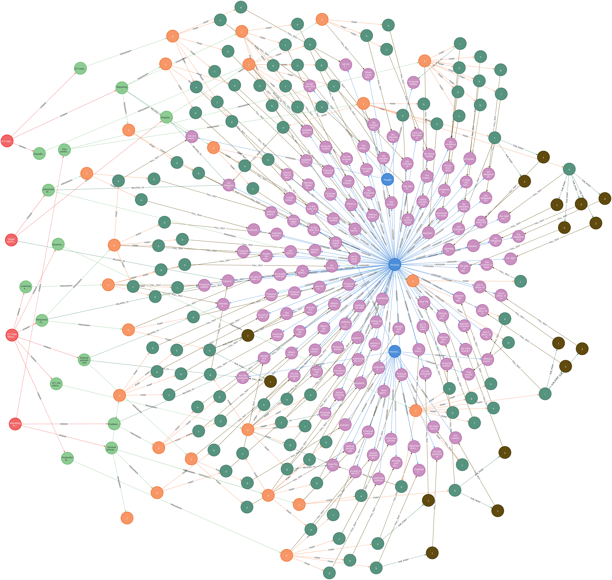
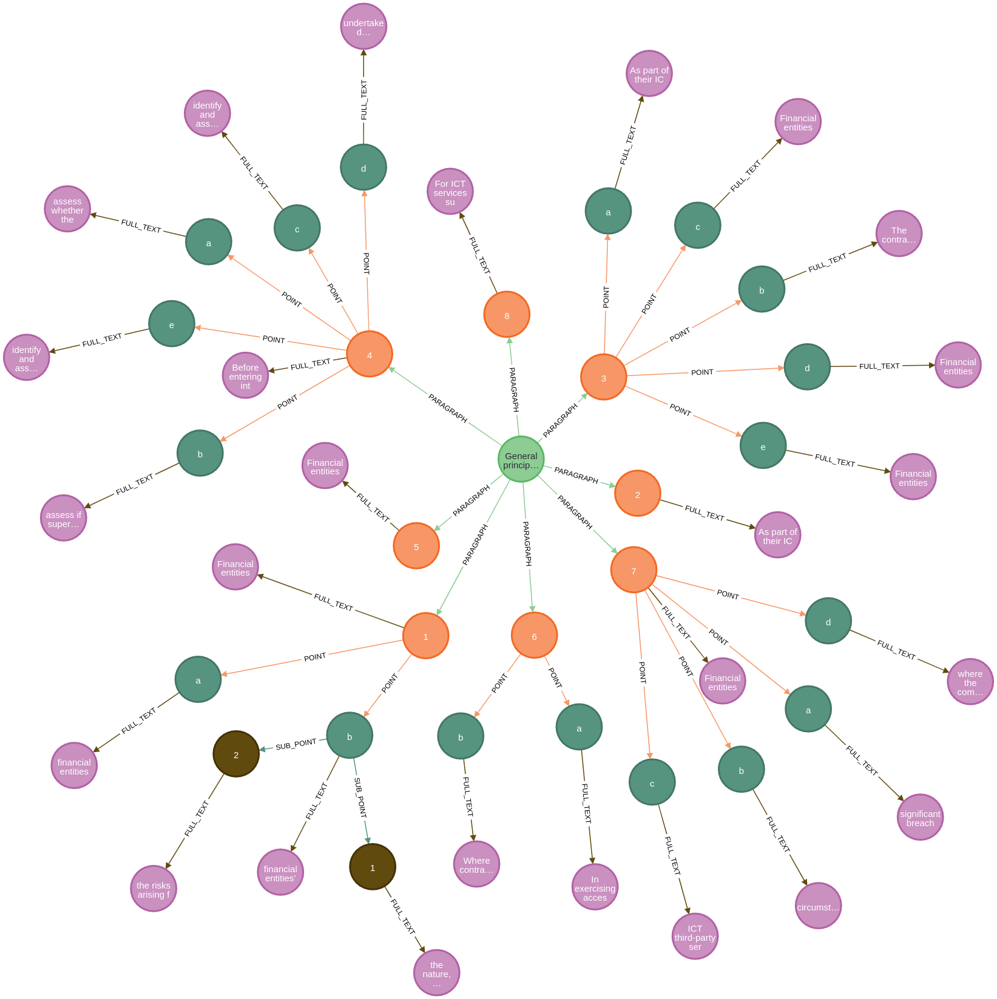

# DORA
### The Digital Operational Resilience Act, or DORA, is a European Union (EU) regulation that creates a binding, 
### comprehensive information and communication technology (ICT) risk management framework for the EU financial sector.

## Required Tools:  Docker and Python 3.10+

# INSTALL AND LOAD XLSX FILE
## Python 3.10
### prepare a new environments for python (root: nist_Grap directory):
### python3 -m venv venv
### source venv/bin/activate
### pip3 install -r requirements.txt

## Docker
### ------- please change "your-user" label with a real value
1. 
sudo docker run -d --publish=7474:7474 --publish=7687:7687 --env=NEO4J_AUTH=none --volume=/home/jiduma/dockerback/dock_DORA/data:/data neo4j

<ignore
sudo docker run -d --publish=7475:7474 --publish=7688:7687 --env=NEO4J_AUTH=none \
    -v $PWD/plugins:/plugins \
    --name neo4j-apoc \
    -e NEO4J_apoc_export_file_enabled=true \
    -e NEO4J_apoc_import_file_enabled=true \
    -e NEO4J_apoc_import_file_use__neo4j__config=true \
    -e NEO4JLABS_PLUGINS=\[\"apoc\"\] \
    --volume=/home/your-user/dockerback/dock_DORA/data:/data neo4j

docker run \
    -p 7474:7474 -p 7687:7687 \
    -v $PWD/data:/data 
    -v $PWD/plugins:/plugins \
    --name neo4j-apoc \
    -e NEO4J_apoc_export_file_enabled=true \
    -e NEO4J_apoc_import_file_enabled=true \
    -e NEO4J_apoc_import_file_use__neo4j__config=true \
    -e NEO4JLABS_PLUGINS=\[\"apoc\"\] \
    neo4j:4.0

<ignore>

## Loading DORA's file
### To load file into docker execute: 
2. python3 main.py

# Exploring graph database (no user and password are needed)
http://0.0.0.0:7474/browser/   or http://localhost:7474/browser/

## Review complete schema - Neo4j Command: 
call db.schema.visualization()  

## Global View

### Getting a partial graph example
        MATCH (d:Domain)-[]-(ar:Article)-[]-(p:Paragraph)-[]-(pt:Point)-[]-(ft:Full_Text)-[]-(cat:Category)
        OPTIONAL MATCH (p)-[r]-(ft2:Full_Text)
        OPTIONAL MATCH (pt)-[r2]-(spt:Sub_Point)-[]-(ft3:Full_Text)
        RETURN d, ar, p, pt, spt, ft, cat, r2, r, ft2, ft3 

### Exploring specific article

        MATCH (ar:Article {ID:28}) // changing the ID code for the article ID that you want to explore
        OPTIONAL MATCH (ar)-[:PARAGRAPH]->(p:Paragraph)        
        OPTIONAL MATCH (p)-[:POINT]->(pt:Point)
        OPTIONAL MATCH (pt)-[:SUB_POINT]->(spt:Sub_Point)
        OPTIONAL MATCH (p)-[:FULL_TEXT]->(ft:Full_Text)
        OPTIONAL MATCH (pt)-[:FULL_TEXT]->(ftp:Full_Text)
        OPTIONAL MATCH (spt)-[:FULL_TEXT]->(fts:Full_Text)
        RETURN ar, p, pt, spt, ft, ftp, fts

### Getting a complete sequencial articles list
        MATCH (art:Article)        
        call { WITH art
        MATCH (art)-[:PARAGRAPH]->(p:Paragraph)-[rf:FULL_TEXT]->(ft:Full_Text) 
        RETURN p.ID as par, '' as point, '' as subpoint,  ft.full_text as ft
        union all
        WITH art
        MATCH (art)-[:PARAGRAPH]->(p:Paragraph)-[:POINT]->(pt:Point)-[rf2:FULL_TEXT]->(ft:Full_Text)
        RETURN p.ID as par, pt.ID as point, '' as subpoint,  ft.full_text as ft
        union all
        WITH art
        MATCH (art)-[:PARAGRAPH]->(p:Paragraph)-[:POINT]->(pt:Point)-[:SUB_POINT]->(spt:Sub_Point)-[:FULL_TEXT]->(ft:Full_Text)
        RETURN p.ID as par, pt.ID as point, spt.ID as subpoint,  ft.full_text as ft
        }
        RETURN art.ID as article, par as paragraph, point, subpoint,  ft
        order by article, paragraph, point, subpoint